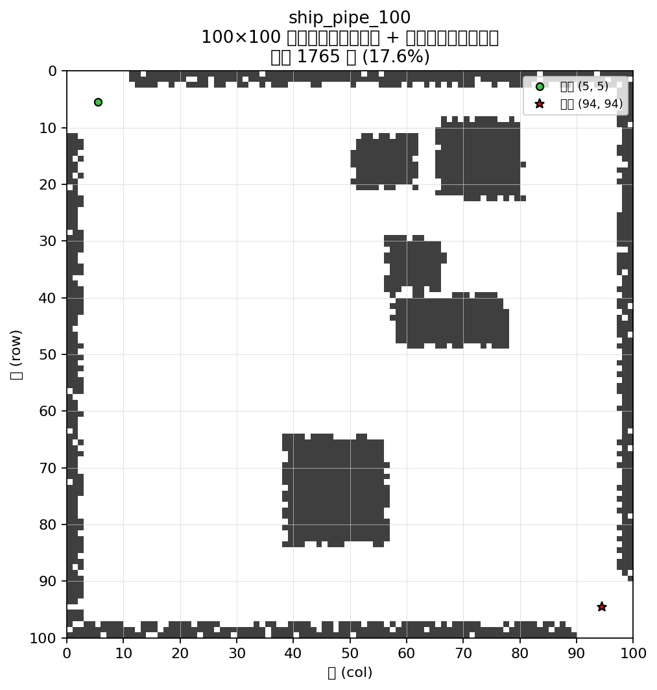
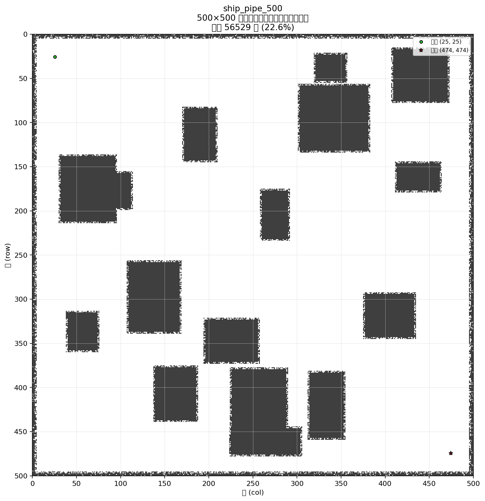
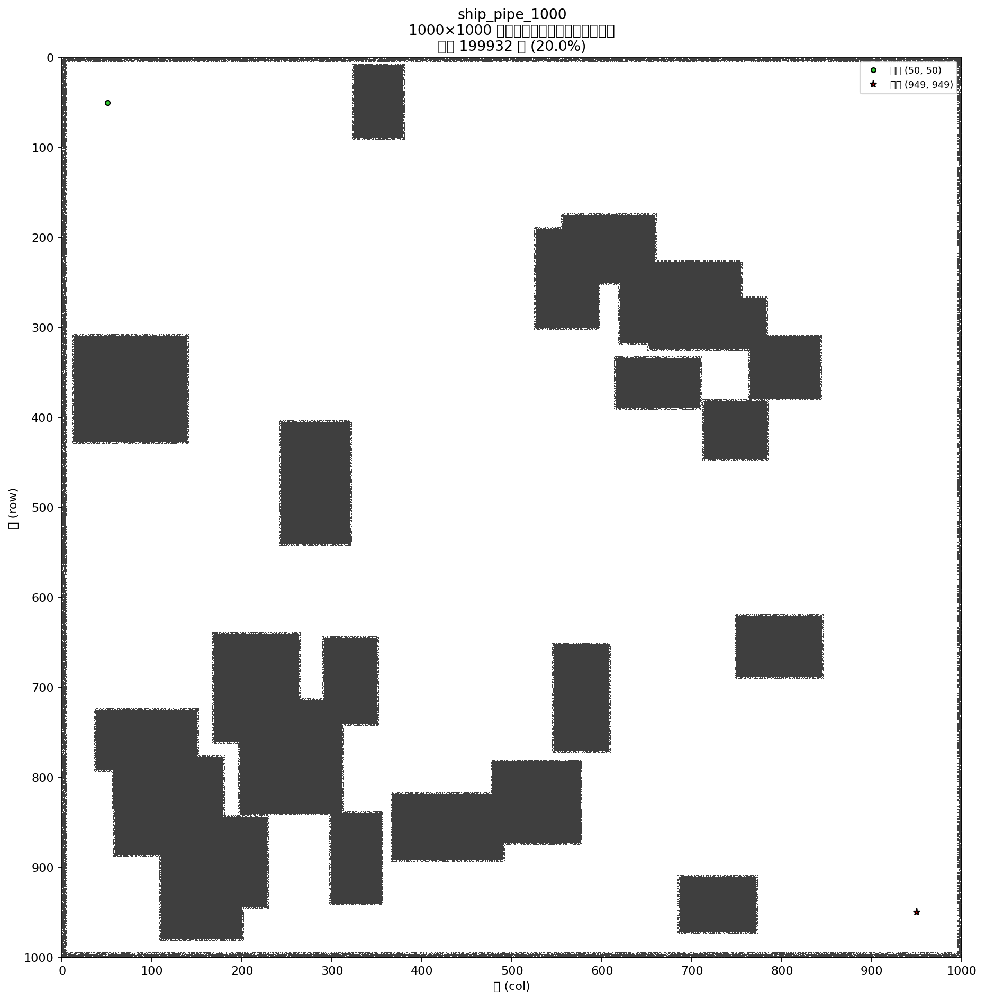

# Sprint 3：大规模栅格路径规划对比

在 Sprint 2 五种算法基础上，采用 **船舶管道模拟环境**（大矩形舱室块 + 外板/贴墙障碍，**管路主走廊保持空旷**），在 **100 / 500 / 1000** 三种尺度上做经典规划与 PPO 课程学习的横向实验。

## 环境设计（船舶管道）

| 规则 | 说明 |
|------|------|
| 大矩形块 | 随机放置舱室/设备矩形障碍，不覆盖主走廊 |
| 贴墙加密 | 外轮廓舱壁、矩形块周边加厚；**开阔走廊内不撒点** |
| 主走廊 | 起终点连线带状空旷区，供管路通行，减轻大图搜索节点爆炸 |
| 移动模型 | 八连通，直行 1、对角 √2，不切角 |

配置见 `configs/env_presets.yaml`，生成逻辑见 `pathplan/env/ship_pipe.py`。

## 目录结构

```
sprint3/
├── README.md
├── configs/
│   ├── env_presets.yaml      # ship_pipe_100 / 500 / 1000
│   └── curriculum.yaml
├── pathplan/
│   ├── env/                  # grid.py, ship_pipe.py, presets.py
│   ├── planners/
│   ├── rl/
│   └── benchmark/
├── scripts/
│   ├── export_env_maps.py
│   ├── train_ppo.py
│   ├── run_benchmark.py
│   └── generate_report.py
└── outputs/
    ├── maps/
    ├── models/
    └── results/
```

## 三种对比环境

| Preset | 规模 | 特点 |
|--------|------|------|
| `ship_pipe_100` | 100×100 | 小图调试与快速对比 |
| `ship_pipe_500` | 500×500 | 中等尺度主对比 |
| `ship_pipe_1000` | 1000×1000 | 大规模可扩展性 |

示意图（`python scripts/export_env_maps.py` 生成）：

| `ship_pipe_100` | `ship_pipe_500` | `ship_pipe_1000` |
|:---:|:---:|:---:|
|  |  |  |

## 快速开始

```bash
cd sprint3
pip install -r requirements.txt
python scripts/export_env_maps.py
python scripts/run_benchmark.py --no-ppo   # 四种经典算法
python scripts/train_ppo.py --fast         # PPO 课程（快速版）
python scripts/run_benchmark.py            # 含 PPO 的五算法对比
python scripts/generate_report.py
```

一键流水线：`python scripts/run_all.py`

## 与 Sprint 2 的关系

- 五种算法自 `sprint2/` 移植；环境由撒点改为 **船舶管道布局**。
- 对比尺度统一为 **100 / 500 / 1000**，便于观察规模放大时的耗时与扩展量。
